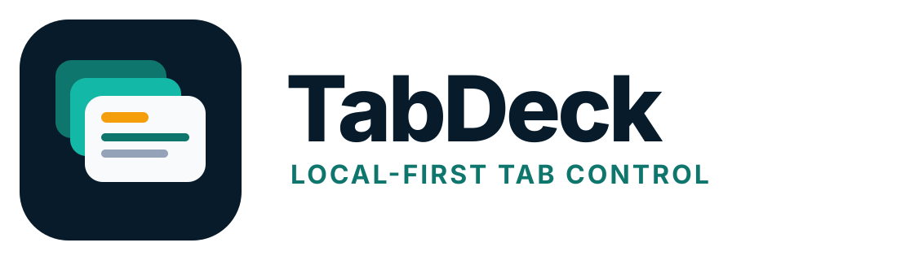

# TabDeck — guided tab capture and restore for Android

<p align="center"></p>

TabDeck is a local-first Android utility for capturing browser links, finding and organizing them later, and opening a chosen set in an installed browser. It treats tabs as durable data instead of pretending Android grants one app access to every other browser's private session.

The public release history starts at **v1.0.0**. Product versions are independent from compatibility formats such as the Room schema, backup format, saved-query codec, and bridge API.

## The guided workflow

1. **Capture** — use Android Share, paste/import, a browser extension, or Windows Desktop Link.
2. **Tabs** — search, filter, tag, group, archive, snooze, deduplicate, and build reusable decks.
3. **Open** — choose a captured set and an installed browser. TabDeck requests one new tab for every valid URL and records dispatch failures honestly.
4. **Settings** — control capture behavior, appearance, exports, maintenance, and the temporary local bridge.

Installed-browser detection identifies an **open target only**. It does not grant access to that browser's live tabs. Live-session capture requires an explicit connector with permission to see the session.

## What TabDeck provides

- Android Share, paste, text-like files, backups, Firefox Android, Chromium desktop extension, and Windows Desktop Link capture routes.
- A searchable, paged Room inventory with Active, Archived, Snoozed, and Trash states.
- Browser, group, source-device/session, tag, pin, note, stale, and lifecycle filters.
- Exact, normalized, and host/path duplicate review with metadata-preserving cleanup.
- Groups, notes, tags, smart views, ordered launch decks, and RE2/J categorization rules.
- Query-wide actions and transfers without arbitrary collection-count ceilings.
- Explicit new-tab requests to a selected Android browser, with pacing, cancellation, and request history.
- JSON backup plus Markdown, hardened CSV, and Netscape bookmarks exports.

TabDeck does not use root, AccessibilityService scraping, VPN interception, hidden APIs, notification scraping, or private browser databases.

## Repository layout

```text
app/                         Android application
branding/                    Product identity and release assets
release/                     Public community signing material
extensions/                 Firefox and Chromium connectors
desktop-link/                Guided Windows ADB/DevTools companion
docs/                        Product, security, operation, and release docs
tools/                       Version, validation, test, and packaging tools
.github/workflows/           CI and automatic release workflows
version.properties           Authoritative public product version
```

## Build locally

Requirements: JDK 17 and Android SDK 36.

```bash
./bootstrap-wrapper.sh
python3 tools/check_version.py
bash tools/run_core_checks.sh
python3 tools/validate_guided_utility.py
python3 tools/validate_project.py
python3 tools/validate_simple_release.py
python3 tools/validate_connector_dom.py
./gradlew clean test lintDebug assembleDebug
```

Windows PowerShell:

```powershell
.\bootstrap-wrapper.ps1
python tools\check_version.py
python tools\validate_guided_utility.py
.\gradlew.bat clean test lintDebug assembleDebug
```

## Release model

No GitHub environment or repository secrets are required. A green version change merged into `main` triggers the Release workflow, which creates or verifies `v<VERSION_NAME>`, builds one community-signed APK, and publishes it with connectors, Desktop Link, branding, source, validation evidence, a manifest, and SHA-256 checksums.

The repository-published signing key provides Android upgrade continuity, not exclusive publisher identity. Verify releases through the official repository, immutable commit, tag, manifest, certificate fingerprint, and checksums.

## Documentation

- [Installation](docs/INSTALLATION.md)
- [User guide](docs/USER_GUIDE.md)
- [Capability matrix](docs/CAPABILITY_MATRIX.md)
- [UX and scope](docs/UX_AND_SCOPE.md)
- [Architecture](docs/ARCHITECTURE.md)
- [Security](docs/SECURITY.md)
- [Bridge protocol](docs/BRIDGE_PROTOCOL.md)
- [Testing](docs/TEST_PLAN.md)
- [Troubleshooting](docs/TROUBLESHOOTING.md)
- [Release notes](docs/RELEASE_NOTES.md)

## Privacy and safety boundaries

Tab data stays local unless the user explicitly shares, exports, or sends it through an enabled loopback bridge. Android backup is disabled, bridge credentials are excluded from portable backups, and no telemetry SDK, cloud account, backend, or app store is required.

TabDeck does not silently truncate valid selections, imports, backups, rules, views, decks, or desktop captures. Protocol and parser boundaries remain for request bytes, URL validity, authentication rate, identifier storage, and regex complexity so malformed or hostile input cannot exhaust the device.
